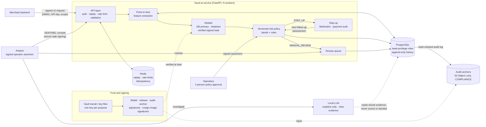
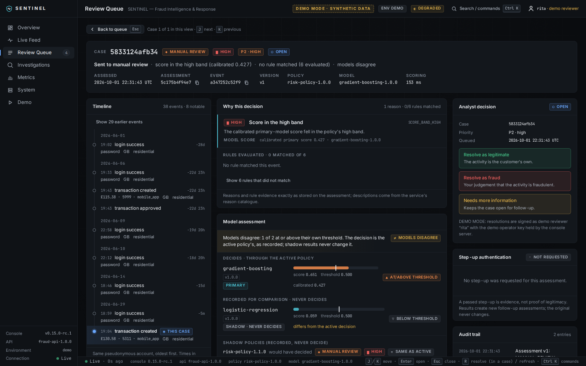

# SENTINEL — Fraud Intelligence & Response: portfolio

A real-time fraud-decision service (`fraud-ai`) and its analyst console (SENTINEL), built
in fifteen stages as a learning and portfolio project.

**Status: portfolio release candidate `v0.15.0-rc1`.** It is **not production software**
and claims no certification or compliance. All data is synthetic; it has never seen real
customers, cards or fraud.

Contents: [Problem](#1-problem) · [Goal](#2-goal) · [System architecture](#3-system-architecture) ·
[ML pipeline](#4-ml-pipeline) · [Security architecture](#5-security-architecture) ·
[Analyst experience](#6-analyst-experience) · [Evaluation](#7-evaluation) ·
[What went wrong](#what-went-wrong-and-how-testing-found-it) ·
[Final result](#9-final-result) · [Limitations](#10-limitations) ·
[What I learned](#11-what-i-learned) ·
[Technical walkthrough](#technical-walkthrough-one-transaction) ·
[CV, application and recruiter versions](#13-cv-application-and-recruiter-versions)

## 1. Problem

For every login or purchase, a merchant must decide whether to allow it, add friction (a
passkey or card check), send it to an analyst, or block it. Four things make this hard:

* **Rare positives.** About 1 % of events are fraud, so accuracy is meaningless.
* **Costly mistakes both ways.** Missed fraud loses money. False positives lose genuine
  customers: the legitimate VPN user, the house mover.
* **Time.** Features must use only what was known at the moment of the decision, or the
  model looks brilliant offline and fails live.
* **Trust.** A decision system that can be quietly changed (a swapped model file, a
  rewritten audit row, a self-approved policy) cannot be trusted, however good its model.

## 2. Goal

Build the whole system, not just a model, and make each part verifiable:

* a service that scores events in real time under a versioned, explainable policy;
* models evaluated honestly, including where the fancier ones lost;
* security controls that are each tested by attacking them;
* an analyst console that shows what the system knows, and admits what it does not;
* something an interviewer can start with one command and watch work in five minutes.

## 3. System architecture

Shadow models and policies are scored and recorded, but never decide. Every failure has an
explicit conservative fallback: a failing secondary model means at least a step-up, and an
unavailable database means "not decided", never an allow.

Three ways to run it, all from one set of scripts ([LOCAL_SETUP.md](LOCAL_SETUP.md)):
**Demo** (SQLite, no Docker), **Dev** (Docker PostgreSQL and Redis), and **StagingLike**
(the staging stack: TLS, Vault, least-privilege roles, S3 Object Lock).

## 4. ML pipeline

* **Synthetic world.** A generator produces users, devices, networks and events across
  eleven scenarios. Six are legitimate: normal, VPN users, shared networks, house movers,
  new customers, legitimate look-alikes. Four are fraud: account takeover, slow takeover,
  new-account fraud, friendly fraud. The eleventh is credential-stuffing bursts against
  genuine accounts. They deliberately overlap: some takeovers are stealthy, and some genuine
  customers look risky.
* **Point-in-time features.** 107 features, each computed from data that had *arrived* by
  the event's time; the snapshot is stored with the assessment. Leakage is tested by
  inserting future data.
* **Shortcut check.** No single feature may separate fraud on its own; the strongest has a
  univariate ROC-AUC of 0.80.
* **Models:**
  * baselines: logistic regression, random forest, **gradient boosting (primary)**;
  * a feed-forward neural network (PyTorch, early stopping on validation PR-AUC);
  * an autoencoder anomaly score (kept as a drift indicator, not a fraud probability);
  * GRU and Transformer sequence models over each user's ordered history, and a hybrid.

  Time-ordered train, validation and test splits; versioned, reproducible, signed
  artefacts.
* **Calibration.** Sigmoid or isotonic, fitted on validation and reported on test.
* **Decisions.** A versioned, immutable policy maps calibrated scores and rules to five
  decisions: ALLOW, ALLOW_WITH_MONITORING, STEP_UP_AUTHENTICATION, MANUAL_REVIEW and
  TEMPORARY_BLOCK. Outside the demo, its bands are **derived from validation data** by a
  cost curve (stated costs: fraud £500, review £5, step-up £1, friction £10).
* **LLM.** A local model explains stored outputs to an analyst from a privacy-checked
  evidence packet. Every claim must cite evidence, and output is validated before storage.
  **It is outside the decision path.**

## 5. Security architecture

| Control | What it prevents |
|---|---|
| Signed v2 requests (method, path, query, body digest, timestamp) with replay protection and downgrade refusal | tampered or replayed API calls |
| Scoped, hashed, expiring, rotatable API keys; per-key rate limits (Redis) | credential misuse, abuse |
| WebAuthn passkeys for step-up (py_webauthn, no custom crypto) | phishable one-time codes |
| Ed25519-signed model artefacts, read once and verified in memory | a swapped or tampered model file |
| Least-privilege PostgreSQL roles (migrator, service, backup, read-only), append-only triggers on history | the service rewriting decisions or its own audit trail |
| Hash-chained audit log + **signed external anchors in S3 Object Lock (COMPLIANCE)** | a DBA-level rewrite that re-chains the log (caught in a staging drill) |
| **Operator authentication**: per-person Ed25519 keys, signed single-use assertions, roles from a registry | "I am the approver" as a plain string |
| **Two-person policy activation**, approvals re-verified at activation | one person changing how every event is decided |
| Vault transit (KMS) with a separate, non-exportable key per purpose; fail-closed, no silent fallback to key files | key reuse, keys on disk |
| cosign image signatures, SLSA provenance and CycloneDX SBOM attestations, verified before release | an unsigned or tampered container image |
| Signed release manifest binding the commit, models, migration revision, policy and audit anchor | an unverifiable release |
| PII rules on free text, keyed pseudonyms, no PAN/CVV/PIN ever | personal data leaking into notes, logs and exports |
| CI: ruff, mypy strict, tests on PostgreSQL + Redis, pip-audit, bandit, detect-secrets, gitleaks, Trivy | regressions and known-vulnerable dependencies |

## 6. Analyst experience

**SENTINEL** (`sentinel-console/`: Next.js 16, React 19, TypeScript) is the analyst
interface: start-up checks, overview, live feed, review queue, a case workspace, system,
metrics and demo pages.

* **Backend-for-frontend.** Its server holds the API key and signs requests, so the browser
  never sees a secret; only allow-listed routes are proxied.
* **Honest states.** Every response is schema-validated; a start-up line is resolved only by
  a real readiness check; an unreachable service is never shown as healthy; stale data is
  labelled with its age.
* **Case workspace.** A one-line summary (decision, leading reason, rules, model agreement),
  a timeline with offsets from the case event, reasons with their stored evidence, primary
  and shadow models side by side with no consensus score, and analyst assistance split into
  observed evidence, interpretation and limitations.
* **Deliberate resolution.** R opens the resolve panel but never submits; the confirmation
  says what will happen; the outcome is recorded with the authenticated reviewer and is
  final. The original assessment never changes.
* **Quality.** WCAG 2.1 A/AA audit on every page in the end-to-end test, keyboard
  workflows, presentation mode, and 1366×768 to 2560×1440 layouts.
* **One command.** `setup-local` and `sentinel-start` on Windows (PowerShell) or
  Linux/macOS; the tooling only ever stops what it started.

## 7. Evaluation

* **Models:** on synthetic test splits with bootstrap intervals. The 1,000-user world has
  only 52 test frauds, so every interval is wide, and this is stated wherever a number
  appears. Gradient boosting: PR-AUC 0.956 [0.917, 0.985]. On the harder Stage 6 world
  (60 test frauds): GB 0.905 [0.832, 0.958], neural network 0.878, GRU 0.851, Transformer
  0.831, hybrid 0.879 ([SEQUENCE_MODELS.md](SEQUENCE_MODELS.md)).
* **Walk-forward:** GB's PR-AUC rose from 0.52 with 15 training frauds to 0.92 with 218, so
  any single split is one draw from a wide range.
* **Calibration:** sigmoid calibration cut logistic regression's Brier score about
  seven-fold; GB was already well calibrated.
* **Explanations:** schema compliance, invalid citations, unsupported claims, privacy
  violations, decision language, evidence coverage, latency.
* **Service:**
  * contract and security regression tests;
  * multi-process and chaos tests (10 concurrent replays: 1 accepted, 9 refused);
  * PostgreSQL load and pool sweeps;
  * a staging stack (TLS, least-privilege roles, Vault, Object Lock) with an E2E test;
  * a 5,000-user load test with a worker kill, a Redis restart and dropped database
    connections under load: 2,004 requests, 0.8 % errors, **no request failed open**.
* **Controls:** each tested by attacking it: tampered models, requests and images; a
  rewritten audit history on a restored clone; self-approval, impersonation, a replayed
  assertion, a wrong role.

## What went wrong, and how testing found it

| Problem | How it was found | What changed |
|---|---|---|
| **Early models were too good.** The first synthetic generator left giveaway features (artefacts of how fraud was written), so models were near-perfect. | Suspiciously high metrics, then a per-feature separability check. | Stage 4 removed the artefacts and added a permanent shortcut check; metrics dropped to something plausible. |
| **The neural network overfit and did not beat gradient boosting.** | The train/validation PR-AUC gap flag (0.117 at the selected epoch); a paired bootstrap comparison. | Early stopping on validation PR-AUC; the network stays a research model. |
| **Sequence models were worse overall.** | Paired comparison and a per-case "caught only by" report. | The GRU caught one stealthy takeover GB missed, at a cost in false positives; none became primary. |
| **The local LLM could not produce structured output.** Qwen2.5-3B: 0/10 valid (every answer truncated at the 1,200-token limit). Llama-3.2-1B: 0/10 (malformed JSON). | A benchmark that runs every output through the same validator as production. | The validator stored nothing invalid; the default stays a deterministic reference template, labelled as such. |
| **SQLite concurrency.** Two deferred write transactions could deadlock, and SQLite fails one with "database is locked". | Concurrent service tests. | One process-wide write lock on SQLite (a no-op on PostgreSQL); PostgreSQL for anything multi-process. |
| **PostgreSQL load behaviour was not what I assumed.** More workers only added contention; the connection pool was not the bottleneck. | A measured worker and pool sweep. | Pool sizes chosen from measurements, not guesses; pool exhaustion fails closed (503). |
| **A CI check could never fail.** `verify \| tee` returned `tee`'s exit status, so the tampered-image check (and the security scans) could not fail the build. | The tampered image was correctly refused in the log, yet the step said "verified". | Every CI step runs with `pipefail`; the tampered-image check now gates. |
| **The privacy export leaked nested keys.** Keyed pseudonyms inside allow-listed JSON metadata were exported. | Running the export on the 5,000-user staging world (the unit-test world had no such keys). | Nested keys are redacted and counted; two regression tests; re-run: 88 redacted, 0 left. |
| **An audit log alone cannot detect an administrator.** A rewritten event, re-chained, still verified. | A tamper drill on a restored backup. | Signed anchors of the chain head in write-once S3 Object Lock storage; the anchors caught the rewrite. |
| **A load-test run was silently invalid.** The worker kill never happened (no `kill` binary in the slim image; the error was swallowed). | Reviewing the run's evidence, not just its summary. | The script signals from Python and records that the worker was confirmed dead; run 1 is reported as invalid. |
| **Windows broke in five places.** No directory file handles or `O_NOFOLLOW`; `Nav.tsx` beside `nav.ts` (one file on NTFS); `NUL` reported as a terminal; cp1252 as the default encoding; a missing `httpx`. | A native Windows CI job on a checkout path with spaces. | Narrow Windows-only branches with regression tests; the weaker check-to-open guarantee is documented ([TRUST_CHAIN.md](TRUST_CHAIN.md#windows-stage-14)). |
| **Docker reported "running" when it was not.** Docker 29 returns success with an empty server version when the daemon is unreachable. | The CI check that StagingLike refuses without Docker. | An empty server version now means "not running"; regression test. |
| **The console's whole layout could scroll away.** On a long case, scrolling past the end moved the entire app shell (navigation and top bar) off-screen. A visually hidden table caption was positioned relative to the shell instead of the scrolling region, making the page taller than the window. | Reviewing the final screenshots by eye: one showed the shell shifted up. A browser probe then measured the document at 2,526 px in a 1,000 px window. | The scrolling region is now the captions' containing block; the end-to-end test checks on every audited view that the document never overflows the window. |
| **Trust gaps found by review.** "Operator" was a configuration string; anchors lived in a local directory; staging used one database superuser. | Design review of what each control actually proved. | Operator authentication with per-person keys; WORM anchors; four least-privilege roles. |

Nothing was fixed by skipping, disabling or loosening a test.

## 9. Final result

* A working service and console that start with one command on Windows, Linux and macOS,
  on a deterministic synthetic world with ten measured demo cases.
* A CI pipeline with seven jobs on every push: lint and types, the full test suite on
  SQLite, PostgreSQL and Redis with a 95 % coverage gate, security scans, a signed and
  verified container image, the console's tests and build, and the local tooling on Linux
  and Windows (including Playwright end-to-end tests with an accessibility audit).
* A documented trust chain: signed requests, models, images and releases; an anchored audit
  log; authenticated two-person policy changes.
* Honest numbers, honest limitations, and a list of what went wrong.

## 10. Limitations

* **Synthetic data only.** The scenarios were written by me, so the models learn this
  generator, not real attackers. No production fraud dataset was used.
* **In the demo, most fraud is still allowed** at the hand-set bands. The demo says so.
* **Stripe was never exercised.** REAL STRIPE TEST NOT PERFORMED: no test credentials. The
  fake provider is not 3-D Secure.
* **The local LLM benchmark failed** on CPU (above); larger models or a GPU were not tried.
* **No penetration test** and no external security review.
* **Single-host testing.** Load and staging tests ran on one machine; the write-once store
  (RustFS) ran on the same host, so a host administrator could delete its files.
* **Key custody is procedural.** Operator keys are files; there is no hardware-token or
  single-sign-on integration.
* **Base-image CVEs.** HIGH CVEs in Debian base packages with no upstream fix are
  documented, not suppressed (HARDENING.md §34).
* **Windows trade-off.** Model and key loading has a weaker check-to-open guarantee on
  Windows; digests and signatures are still verified.
* **The console is a single-analyst tool.** No case assignment or multi-user sessions;
  outside the demo each resolution needs the analyst's own signed assertion.
* **No erasure execution.** The design is in PRIVACY.md §6.

## 11. What I learned

* **Distrust good results.** Near-perfect metrics on synthetic data meant the data was
  leaking the answer.
* **Measure, then choose.** Gradient boosting beat more complex models here, and pool
  sizes came from measurements; in both cases my first assumption was wrong.
* **Keep AI where it is safe.** An LLM that explains with citations is useful; one that
  decides would be non-deterministic and open to prompt injection through event text.
* **A control is only as good as its test.** The audit chain, the CI security gates and the
  load test each looked fine until something attacked or checked them properly.
* **Real environments find real bugs.** Staging found the privacy leak; Windows CI found
  five platform assumptions; each became a regression test.
* **Write down what did not work.** It is the most convincing part of the project.

## Technical walkthrough: one transaction

What happens to one payment, for a technical interviewer. Code paths are under `fraud_ai/`.

1. **Event.** The merchant's backend sends `POST /v1/score` with a JSON event (event id,
   type `TRANSACTION_CREATED`, user, device, session, amount as a decimal string and a
   currency) and these headers:
   * `Authorization: Bearer <key_id>.<secret>`: a scoped API key, stored only as a hash;
   * `X-Fraud-Timestamp` and `X-Fraud-Signature: v2=…`: an HMAC over the method, path,
     sorted query, timestamp and SHA-256 of the body;
   * `Idempotency-Key`: so a retry cannot score twice.
2. **Validation** (`service/`, `core/events.py`). The key's scope must include
   `score:write`; the signature must match, be fresh (300 s) and never have been used
   (claimed atomically in Redis, or in the database on one process). The body is parsed by
   a strict pydantic contract: no floats for money, currency-valid amounts, known enums.
   Errors name fields, never values.
3. **Ingestion.** The event is stored once with its *arrival time*; a duplicate event id
   returns the latest existing assessment.
4. **Feature snapshot** (`features/`). The 107 features are computed as of the event,
   using only rows that had arrived by then (account age, device history, velocity
   windows, network and account changes). The snapshot and its hash are stored.
5. **Models** (`models/`). The primary gradient-boosting model and the shadow models come
   from a cache that loaded each artefact once, checking its SHA-256 digest and Ed25519
   signature over the exact bytes loaded. The primary produces a raw score; shadows are
   recorded only.
6. **Calibration.** The raw score is mapped to a calibrated probability by the calibrator
   fitted on validation data and referenced by the active deployment.
7. **Rules** (`rules/`). Versioned rules (for example a burst of failed logins, or a step-up failure)
   are evaluated; each records whether it matched and the evidence.
8. **Policy** (`risk/`, orchestrated by `realtime/service.py`). The active, immutable policy version maps the
   calibrated probability to a band and combines it with the rules into one decision and
   its reason codes. If anything fails, an explicit fallback applies (a failed secondary
   model means at least a step-up; a database failure means 503 with a MANUAL_REVIEW hint).
9. **Immutable assessment.** The decision, reason codes, policy version, model versions,
   feature snapshot hash and shadow results are written once. The API response carries the
   decision and reason codes, never scores, features or personal data.
10. **Review or step-up.** `MANUAL_REVIEW` creates one review item (idempotent under
    redelivery). `STEP_UP_AUTHENTICATION` lets the merchant start a WebAuthn challenge or an
    external payment authentication; the result creates a *new* follow-up assessment
    (success → `ALLOW_WITH_MONITORING`), never an edit.
11. **Analyst investigation.** In SENTINEL, the console's server calls the read-only
    `/v1/analyst/*` views. The analyst sees the timeline, reasons with evidence, models
    side by side, and can request an explanation: the service builds a privacy-checked
    evidence packet, the explainer must cite it, and the output is validated before it is
    stored. The analyst resolves the review with a signed operator assertion; the outcome
    is recorded with the verified reviewer, and an audit event joins the hash chain.

## 13. CV, application and recruiter versions

### GitHub repository description

> SENTINEL: a real-time fraud-decision service and analyst console (Python, FastAPI,
> PostgreSQL, Redis, scikit-learn, PyTorch, Next.js) built as a portfolio project on
> synthetic data, with signed models, an anchored audit log and authenticated two-person
> policy changes. Not production software.

### CV project entry

> **SENTINEL — fraud-decision service and analyst console** (personal project, synthetic data)
> * Built a Python/FastAPI service that scores logins and payments in real time from 107
>   point-in-time features with gradient boosting, under a versioned risk policy, with
>   PostgreSQL and Redis.
> * Evaluated seven model types (including PyTorch neural and sequence models) with PR-AUC,
>   bootstrap confidence intervals, calibration and walk-forward validation, and documented
>   why gradient boosting stayed primary.
> * Implemented and attack-tested security controls: HMAC request signing with replay
>   protection, signed models, a hash-chained audit log with write-once anchors,
>   authenticated two-person approval, least-privilege database roles, signed containers.
> * Built a Next.js/TypeScript analyst console with server-side request signing and
>   accessibility checks; CI runs the full test suite (95 % coverage gate), security scans
>   and end-to-end tests on Linux and Windows.

### Apprenticeship application

> I built SENTINEL to understand how a fraud-detection system really works, from the data to
> the people who use it. It decides in real time whether a login or payment looks
> suspicious, and gives analysts a web console to investigate. I used Python, FastAPI,
> PostgreSQL, machine learning with scikit-learn and PyTorch, and Next.js. A lot of the
> learning came from things that went wrong: my first models were "too good" because my
> synthetic data gave the answer away, a neural network did not beat a simpler model, and a
> local AI model could not produce reliable structured answers. Each time, a test showed me
> the problem, and I fixed the cause instead of hiding it. I also learned to treat AI as an
> assistant that explains with evidence, not something that makes decisions. It is a
> learning project on synthetic data, not a production system, and I have documented its
> limits.

### "What did you build?" — 30 seconds

> I built SENTINEL, a fraud-detection system with an analyst console. When someone logs in
> or pays, it decides in milliseconds whether to allow it, ask for extra verification, or
> send it to a human, using machine-learning models under a versioned policy. Analysts
> investigate cases in a web app. I focused on making it trustworthy: signed models, an
> audit log that cannot be rewritten unnoticed, and an AI assistant that explains decisions
> but never makes them. It runs on synthetic data, with one command.

### 2 minutes

> SENTINEL has two parts: a Python service that makes fraud decisions, and a Next.js
> console for analysts.
>
> For each event, the service computes 107 features using only information available at
> that moment, so there is no leakage from the future. A gradient-boosting model scores it;
> the score is calibrated; and a versioned policy turns it into one of five decisions, from
> allow to block. Every decision is stored immutably with its reasons and versions.
>
> On the machine-learning side, I compared seven model types, including neural networks
> and sequence models over a customer's history. Gradient boosting stayed best on this
> tabular data, and I report PR-AUC with confidence intervals because fraud is rare.
>
> On security, requests are signed and cannot be replayed, models are signed and verified
> before loading, the audit log is anchored in write-once storage, and changing the policy
> needs two authenticated people.
>
> The console lets an analyst see the timeline, compare models, ask for an AI explanation
> that must cite evidence, and resolve the case. The honest caveats: it is synthetic data,
> and it is not production software. What I am proudest of is the list of things that went
> wrong and how tests found them.

### 5 minutes (technical)

Use the [technical walkthrough](#technical-walkthrough-one-transaction) above as the
spine, then add:

1. **Why point-in-time features** (leakage), and the shortcut check (no feature above
   ROC-AUC 0.80).
2. **Why PR-AUC with bootstrap intervals** (1 % prevalence, 52–60 test frauds), and why
   gradient boosting beat the neural and sequence models on tabular data.
3. **The trust chain:** v2 request signatures with Redis replay claims; Ed25519 model
   signatures verified over the bytes loaded; the hash-chained audit log and why only an
   external write-once anchor detects an administrator; two-person policy activation with
   per-person keys.
4. **The LLM's place:** outside the decision path; cited, validated output; why the small
   local models failed and the reference template is the default.
5. **What went wrong** (the table above), especially the CI `pipefail` bug and the privacy
   export leak, and what a real dataset would change (label delay, selection bias,
   re-deriving the bands from real costs, shadow mode first).

Walkthrough: [DEMO.md](DEMO.md). Interview preparation: [INTERVIEW_GUIDE.md](INTERVIEW_GUIDE.md).
