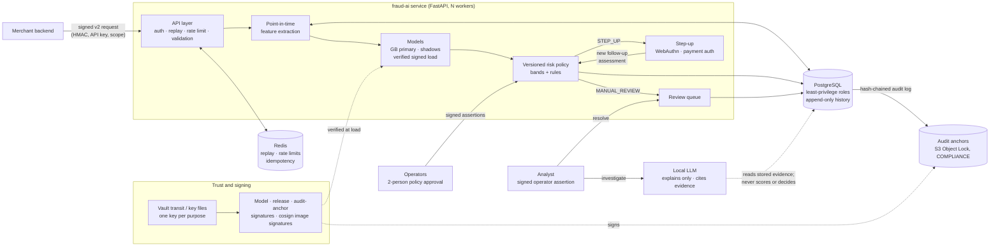

# fraud-ai: portfolio summary

A fraud-prevention platform, built in twelve stages as a learning and portfolio project.
It scores payment and account events in real time, decides what to do about them under a
versioned policy, and keeps every decision verifiable afterwards.

**Status: a release candidate of a portfolio project (`v0.12.0-rc1`).** It is **not
production software** and claims no compliance. All data is synthetic; it has never seen
real customers, cards or fraud.

## 1. The problem

A merchant must decide, for each login or purchase, whether to allow it, add friction,
send it to an analyst, or block it. Four things make this hard:

* **Rare positives.** About 1 % of events are fraud, so accuracy is meaningless.
* **Costly mistakes both ways.** Missed fraud loses money. False positives lose genuine
  customers: the legitimate VPN user, the house mover.
* **Time.** Features must use only what was known at the moment of the decision.
* **Trust.** A decision system that can be quietly changed (a swapped model file, a
  rewritten audit row, a self-approved policy) cannot be trusted, however good its model.

## 2. Architecture

**The scoring path:**

1. validate and authenticate the request;
2. ingest the event idempotently;
3. compute point-in-time features;
4. score with cached, signature-verified models;
5. calibrate;
6. apply the rules and the active policy;
7. store an **immutable** assessment.

Shadow models and policies are scored and recorded, but never decide. Every failure has an
explicit conservative fallback: a failing secondary model means at least a step-up, and an
unavailable database means "not decided", never an allow.

## 3. The ML approach

* **Synthetic world.** A generator produces users, devices, networks and events across
  eleven scenarios. Six are legitimate: normal, VPN users, shared networks, house movers,
  new customers, legitimate look-alikes. Four are fraud: account takeover, slow takeover,
  new-account fraud, friendly fraud. The eleventh is credential-stuffing bursts against
  genuine accounts. They deliberately overlap: some
  takeovers are stealthy, and some genuine customers look risky. Stage 4 removed the
  generator's giveaways, so no single feature separates fraud (the best has ROC-AUC 0.80).
* **Point-in-time features.** Every feature is computed from what was known at the event's
  time, and the feature snapshot is stored with the assessment. Leakage is tested.
* **Models:**
  * baselines: logistic regression, random forest, **gradient boosting (primary)**;
  * a feed-forward network;
  * an autoencoder anomaly score;
  * GRU and Transformer sequence models over each user's ordered history.

  Time-ordered train, validation and test splits; versioned, reproducible, signed
  artefacts.
* **Evaluation:**
  * PR-AUC with stratified bootstrap intervals, and walk-forward folds;
  * calibration, cost-sensitive thresholds;
  * scenario and cohort false-positive analysis;
  * paired model comparison (bootstrap and McNemar);
  * a drift baseline.
* **Decisions.** A versioned, immutable policy maps calibrated scores to five decisions:
  ALLOW, ALLOW_WITH_MONITORING, STEP_UP_AUTHENTICATION, MANUAL_REVIEW and
  TEMPORARY_BLOCK. Its bands are **derived from validation data** by a cost curve.
* **LLM.** A local model explains stored outputs to an analyst from a privacy-checked
  evidence packet. Every claim must cite evidence, and output is validated before storage.
  **It is outside the decision path.**

## 4. Security controls

| Control | What it prevents |
|---|---|
| Signed v2 requests (method, path, query, body digest, timestamp) with replay protection and downgrade refusal | tampered or replayed API calls |
| Scoped, hashed, expiring, rotatable API keys; per-key rate limits (Redis) | credential misuse, abuse |
| Ed25519-signed model artefacts, read once and verified in memory | a swapped or tampered model file |
| Least-privilege PostgreSQL roles (migrator, service, backup, read-only), append-only triggers on history | the service rewriting decisions or its own audit trail |
| Hash-chained audit log + **signed external anchors in S3 Object Lock (COMPLIANCE)** | a DBA-level rewrite that re-chains the log (caught in a staging drill) |
| **Operator authentication**: per-person Ed25519 keys, signed single-use assertions, roles from a registry | "I am the approver" as a plain string |
| **Two-person policy activation**, approvals re-verified at activation | one person changing how every event is decided |
| Vault transit (KMS) with a separate, non-exportable key per purpose; fail-closed, no silent fallback to key files | key reuse, keys on disk |
| cosign image signatures, SLSA provenance and CycloneDX SBOM attestations, verified before release | an unsigned or tampered container image |
| Signed release manifest binding the image digest, models, migration revision, policy and audit anchor | an unverifiable release |
| PII rules on free text, keyed pseudonyms, no PAN/CVV/PIN ever | personal data leaking into notes, logs and exports |
| CI: ruff, mypy strict, tests on PostgreSQL + Redis, pip-audit, bandit, detect-secrets, gitleaks, Trivy | regressions and known-vulnerable dependencies |

## 5. How it was evaluated

* **Models:** on synthetic test splits with bootstrap intervals. The 1,000-user world has
  only 52 test frauds, so every interval is wide, and this is stated wherever a number
  appears. Gradient boosting: PR-AUC 0.956 [0.917, 0.985].
* **Explanations:** schema compliance, invalid citations, unsupported claims, privacy
  violations, decision language, evidence coverage, latency. Stage 12 ran two real local
  models (Qwen2.5-3B, Llama-3.2-1B). **Neither produced schema-valid output** on this CPU,
  so the reference template stays the default (LLM_ANALYST.md).
* **Service:**
  * contract and security regression tests;
  * multi-process and chaos tests;
  * PostgreSQL load and pool sweeps;
  * a staging stack (TLS, least-privilege roles, Vault, Object Lock) with an E2E test;
  * a Stage 12 load test on a 5,000-user world (HARDENING.md §33).
* **Controls:** each is tested by attacking it:
  * tampered models, requests and images;
  * a rewritten audit history on a restored clone;
  * self-approval, impersonation, a replayed assertion, a wrong role.

## 6. What failed, and what changed

* **Early models were too good.** The first synthetic world had giveaway features. Stage 4
  removed them and added a shortcut check. The metrics dropped to something plausible.
* **The neural network did not beat gradient boosting.** PR-AUC difference +0.054
  [−0.004, +0.115]. It stays a research model.
* **The sequence models were worse overall.** The GRU caught one stealthy takeover that GB
  missed, at a cost in false positives. None was adopted as primary.
* **The anomaly score is a weak, noisy fraud signal.** It is kept as a drift indicator
  only.
* **Early CI runs failed:**
  * a setuptools CVE;
  * an unresolvable action tag;
  * a PyTorch test fixture flagged as a model file;
  * clean-up of container-owned files.

  Each was fixed at the root. Nothing was skipped.
* **Trust gaps found by review:**
  * "operator" was configuration, so Stage 12 added real authentication;
  * the audit anchors were in a local directory, now in WORM storage;
  * the staging stack used one database superuser, now four roles.
* **In the demo, most fraud is still allowed** at the hand-set bands. The demo says so
  instead of hiding it.

## 7. Current limitations

* **Synthetic data only.** The scenarios were written by the author, so the models learn
  this generator, not real attackers.
* **Stripe was never exercised.** REAL STRIPE TEST NOT PERFORMED: no test credentials, and
  the network is blocked. The fake provider is not 3-D Secure.
* **Single-host testing.** The load test separated the containers but not the machines.
  No multi-host network test was possible here.
* **WORM is enforced at the S3 API only.** The staging object store (RustFS) runs on the
  same host, so a host administrator could delete its files.
* **Key custody is procedural.** Operator keys are files; there is no hardware-token
  integration.
* **Base-image CVEs.** Eight HIGH CVEs in Debian base packages have no upstream fix yet.
  They are documented, not suppressed.
* **No analyst UI.** ANALYST_WORKFLOW.md is a contract only.
* **No erasure execution.** The design is in PRIVACY.md §6.

## 8. CV and GitHub summary

**GitHub (repository description):**
> Real-time fraud scoring platform (Python, FastAPI, PostgreSQL, Redis, scikit-learn,
> PyTorch) built as a portfolio project on synthetic data: point-in-time features,
> versioned risk policies, step-up authentication, and a verifiable trust chain (signed
> models, images and releases; WORM audit anchors; two-person, authenticated policy
> changes). Not production software.

**CV project entry:**
> **fraud-ai: real-time fraud-prevention platform (personal project, synthetic data)**
> * Built a Python service that scores payment and login events in real time, using
>   point-in-time features and a gradient-boosting model, under a versioned decision
>   policy.
> * Evaluated models with PR-AUC, bootstrap confidence intervals and walk-forward
>   validation. Documented where neural and sequence models did *not* beat gradient
>   boosting.
> * Implemented security controls and tested each by attacking it:
>   * HMAC request signing with replay protection;
>   * least-privilege PostgreSQL roles;
>   * signed model artefacts;
>   * a hash-chained audit log with WORM anchors;
>   * authenticated two-person approval.
> * Ran it on a staging stack (Docker Compose, TLS, Vault, S3 Object Lock) with CI
>   covering tests, type checks, dependency, secret and container scanning, and signed
>   container images with SBOM and provenance.

**Apprenticeship application (short paragraph):**
> I built fraud-ai to learn how a fraud-detection system works end to end, and what it
> takes to make one trustworthy. It scores synthetic payment and login events in real
> time, explains its decisions to analysts with a local LLM that never makes decisions,
> and protects its own integrity: signed models, a tamper-evident audit log, and policy
> changes that need two authenticated people. I measured everything I could and wrote
> down what did not work, such as neural models that did not beat gradient boosting. It
> is a learning project on synthetic data, not a production system.

Walkthrough: [DEMO.md](DEMO.md). Interview preparation: [INTERVIEW_GUIDE.md](INTERVIEW_GUIDE.md).
