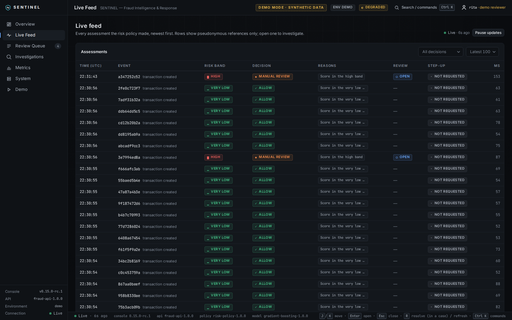
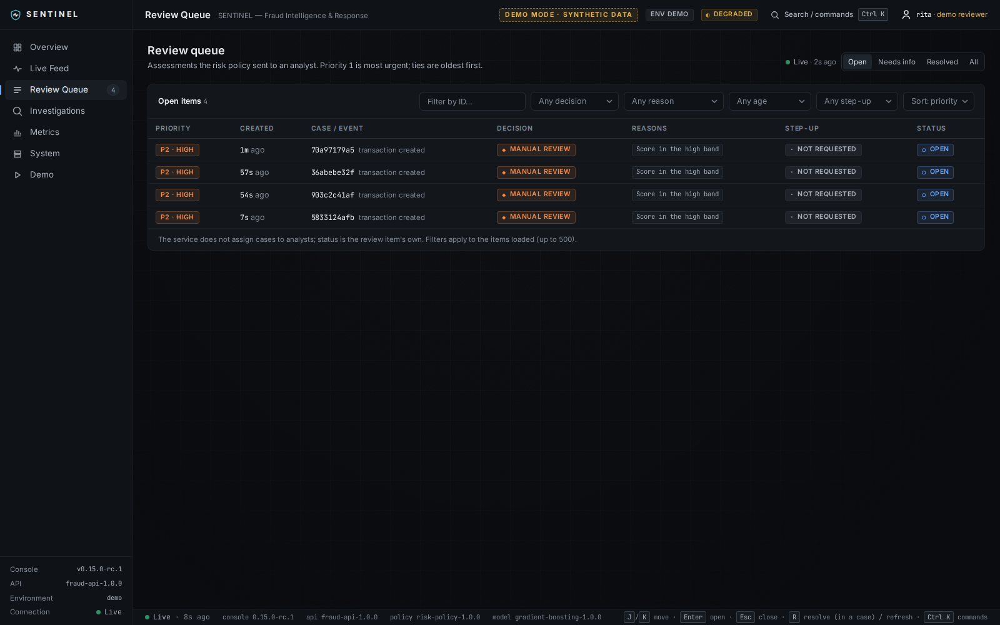
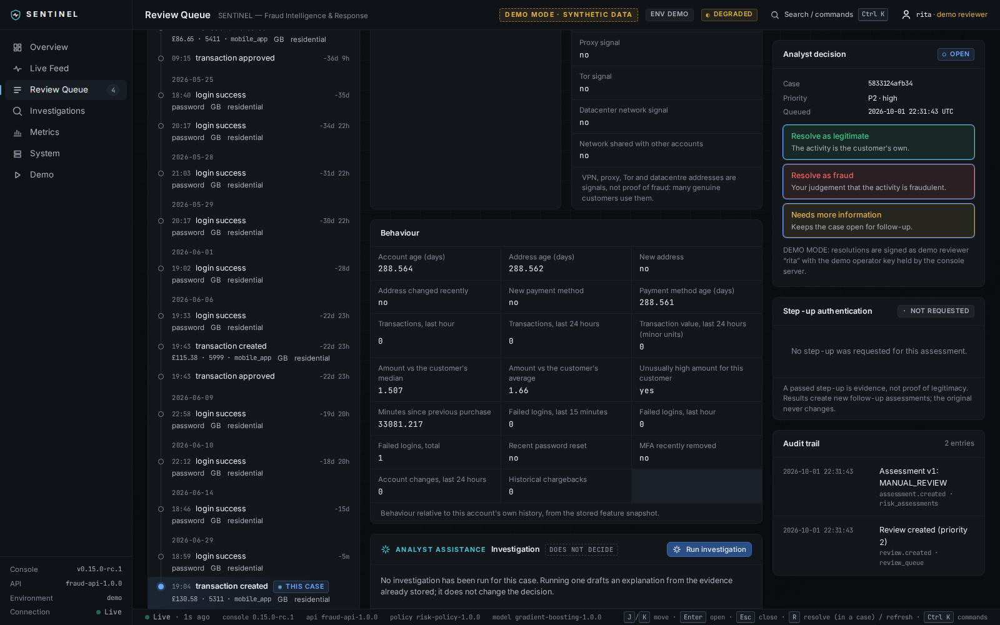
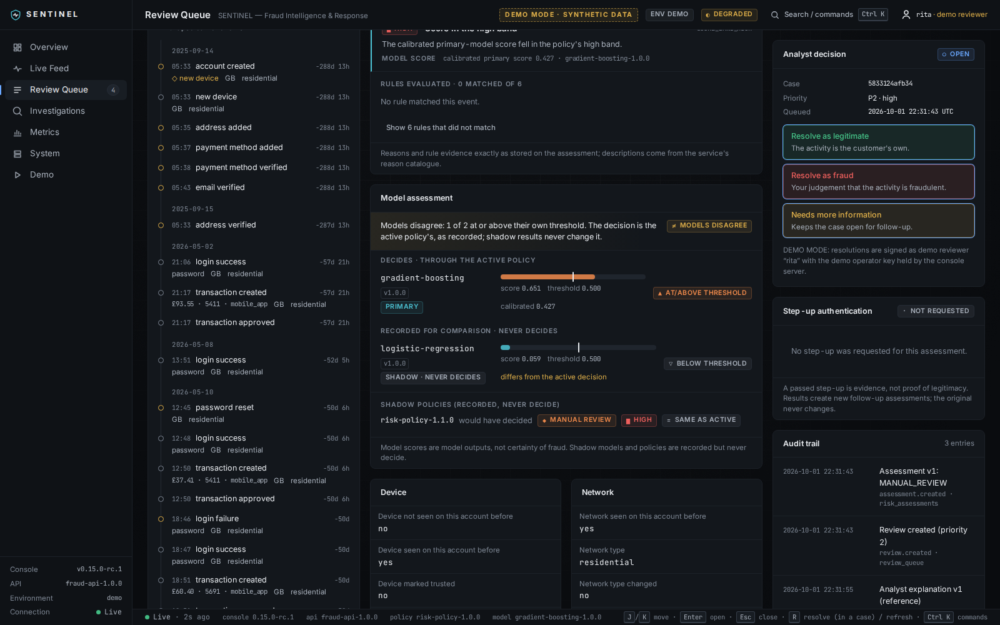
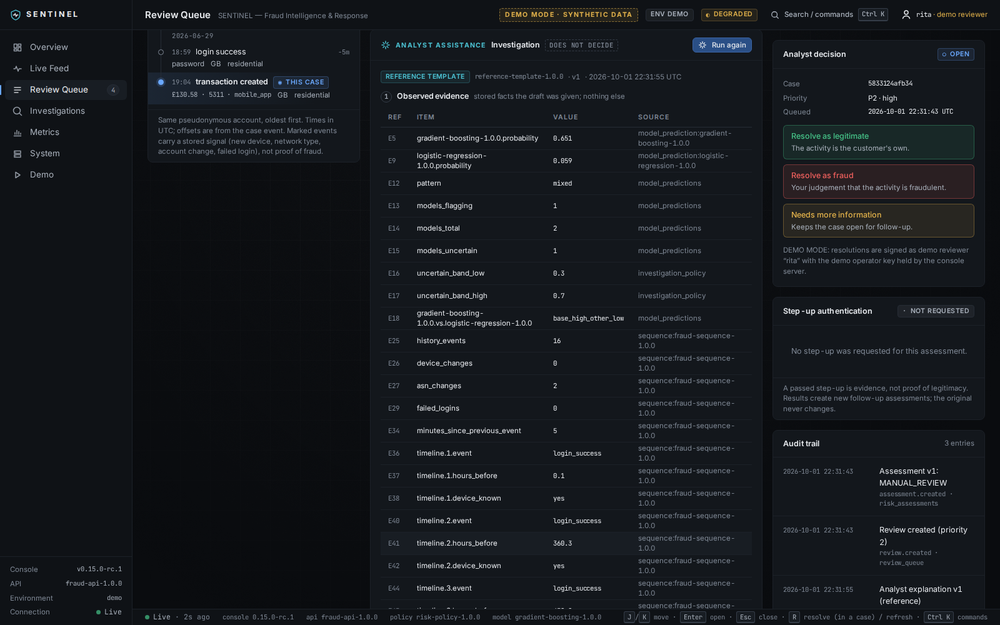
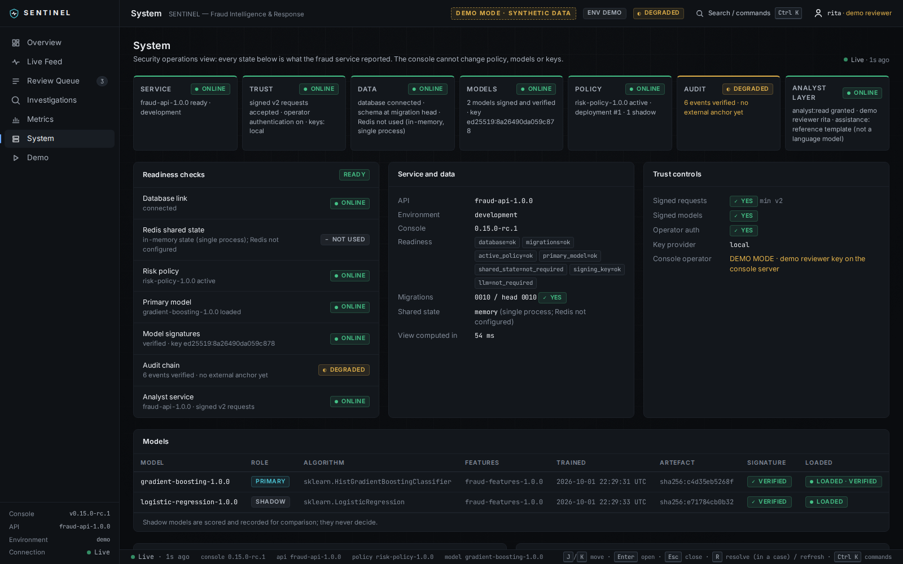
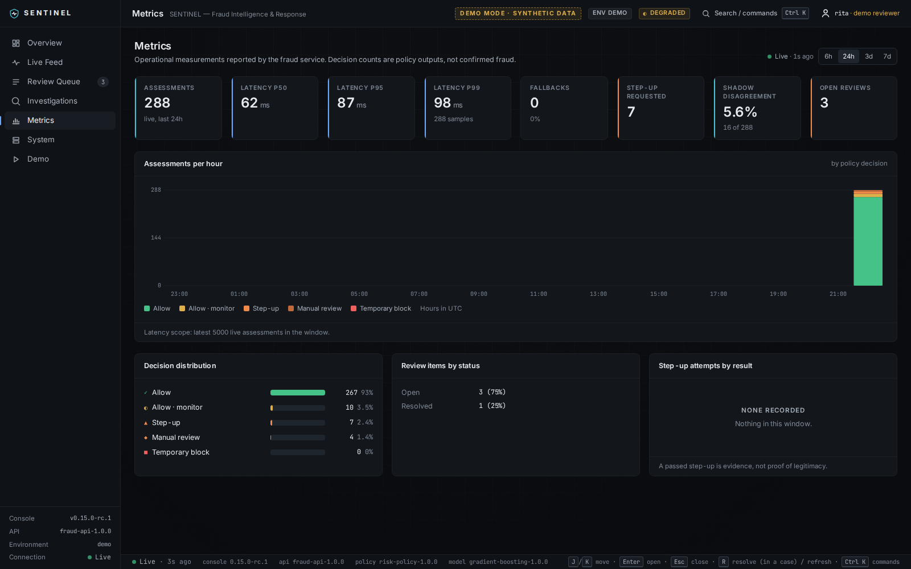
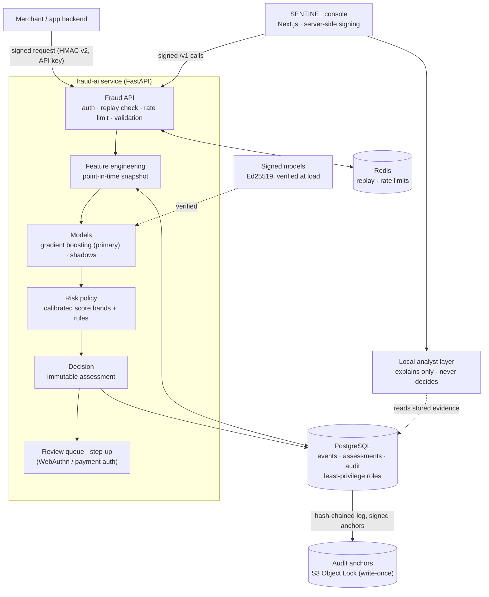

# SENTINEL

**Fraud Intelligence & Response** — a real-time fraud-decision service and the analyst
console that investigates its decisions. Built from scratch as a portfolio and learning
project, on synthetic data only.


**What it is.** When someone logs in or pays, a merchant has to decide in milliseconds
whether to allow it, add friction (a passkey or card check), send it to an analyst, or
block it. SENTINEL makes that decision with machine-learning models under a versioned
policy, explains it, and lets an analyst investigate and resolve the case in a web
console.

**Why it exists.** I wanted to learn how a fraud system works end to end, and what it takes
to make one *trustworthy*: decisions that cannot leak future data, models that cannot be
swapped silently, an audit trail that cannot be rewritten, and an AI assistant that
explains but never decides.

**What it demonstrates.**

* **Machine learning done carefully:** point-in-time features, time-ordered evaluation,
  PR-AUC with confidence intervals, calibration, and honest comparisons in which the
  neural and sequence models did *not* beat gradient boosting.
* **Security engineering:** signed requests with replay protection, signed models, a
  tamper-evident audit log with write-once anchors, authenticated two-person approval,
  least-privilege database roles, signed releases and container images.
* **Product engineering:** an analyst console with a backend-for-frontend, honest degraded
  states, keyboard workflows, accessibility checks, and one-command local start-up on
  Windows, Linux and macOS.

**Built with:** Python 3.11 · FastAPI · SQLAlchemy and Alembic · PostgreSQL · Redis ·
scikit-learn · PyTorch · Next.js 16 · React 19 · TypeScript · TanStack Query · Zod ·
Playwright · Docker · GitHub Actions · HashiCorp Vault · S3 Object Lock · cosign.

> **Status: portfolio release candidate `v0.15.0-rc1`.** Not production software, and not
> certified for anything (no PCI DSS, SOC 2, ISO or GDPR claim). Every number in this
> repository comes from **synthetic** data; none is a real-world fraud-detection rate.

### Try it in two commands

```powershell
.\scripts\setup-local.ps1                       # Windows 11 (PowerShell)
.\scripts\sentinel-start.ps1 -Mode Demo         # opens http://127.0.0.1:3000
```

```bash
./scripts/setup-local.sh                        # Linux / macOS
./scripts/sentinel-start.sh --mode demo         # opens http://127.0.0.1:3000
```

Needs Python 3.11+, Node.js 22 LTS and Git; no Docker. The first start builds the synthetic
demo world (3–5 minutes); later starts take seconds. Stop with `sentinel-stop`.

---

## Contents

[Overview](#overview) · [Demo](#demo) · [Screenshots](#screenshots) ·
[Architecture](#architecture) · [How fraud scoring works](#how-fraud-scoring-works) ·
[ML evaluation](#ml-evaluation) · [Security design](#security-design) ·
[Analyst console](#analyst-console) · [Local setup](#local-setup) · [Testing](#testing) ·
[Project stats](#project-stats) · [Limitations](#limitations) ·
[What I learned](#what-i-learned) · [Roadmap and future work](#roadmap-and-future-work) ·
[Documentation map](#documentation-map)

## Overview

The repository has two parts:

| Part | Directory | What it is |
|---|---|---|
| **fraud-ai** (backend) | `fraud_ai/` | The fraud-decision service: event ingestion, point-in-time features, models, risk policy, review queue, step-up authentication, audit log, and a `fraud-ai` CLI. |
| **SENTINEL console** | `sentinel-console/` | The analyst web app. It is only a *client* of the service's `/v1` API: no scoring or decision logic lives in the browser. |

Decisions are internal policy outputs: `ALLOW`, `ALLOW_WITH_MONITORING`,
`STEP_UP_AUTHENTICATION`, `MANUAL_REVIEW` and `TEMPORARY_BLOCK`. The service never moves
money and never authenticates cardholders itself; step-up runs through WebAuthn passkeys or
an external payment-authentication adapter.

It was built in fifteen stages, each verified before the next; the history is in
[ROADMAP.md](ROADMAP.md) and the current state in [PROJECT_STATUS.md](PROJECT_STATUS.md).

## Demo

A deterministic synthetic world (seed `20260701`, 360 users) with ten scripted cases. Every
expected decision was **measured** from the running service, not chosen, so a missed fraud
is shown as missed:

| Case | Measured decision | Honest reading |
|---|---|---|
| Normal purchase | ALLOW | correct |
| Legitimate VPN customer | ALLOW | correct: a VPN is a signal, not proof |
| House mover | ALLOW | correct |
| Large legitimate purchase | ALLOW | correct |
| High-velocity fraud | ALLOW | **missed** by the model |
| Account takeover | STEP_UP_AUTHENTICATION | caught, with friction rather than a block |
| Stealth (slow) takeover | ALLOW_WITH_MONITORING | weakly flagged |
| Manual review | MANUAL_REVIEW | a **false positive**: a genuine customer |
| Step-up, then success | STEP_UP_AUTHENTICATION → ALLOW_WITH_MONITORING | friction for a genuine customer |
| Step-up, then failure | STEP_UP_AUTHENTICATION → stays STEP_UP | the provider result is simulated |

The 5–8 minute interview walkthrough (exact clicks and what to say), fallbacks and a video
shot list are in [DEMO.md](DEMO.md).

## Screenshots

All screenshots are of the synthetic demo world, captured by the end-to-end test.

| | |
|---|---|
|  **1. Start-up:** seven trust and readiness checks, each resolved by the running service |  **2. Overview:** live metrics, flagged assessments, system health |
|  **3. Live feed:** every recent decision, newest first |  **4. Review queue:** cases waiting for an analyst |
|  **5. Case:** a one-line summary of what happened and why |  **6. Timeline:** the customer's history before the event |
|  **7. Models:** primary vs shadow, never a vote |  **8. Analyst assistance:** cited evidence, interpretation, limitations |
|  **9. System:** signed models, policy, audit chain, trust settings |  **10. Metrics:** decisions over time, reviews, step-up results |

## Architecture



Deeper: [ARCHITECTURE.md](ARCHITECTURE.md) (the backend) and
[sentinel-console/ARCHITECTURE.md](sentinel-console/ARCHITECTURE.md) (the console).

## How fraud scoring works

One login or payment, end to end (the full technical walkthrough is in
[PORTFOLIO.md](PORTFOLIO.md#technical-walkthrough-one-transaction)):

1. **Validate and authenticate.** A merchant sends a signed request. The service checks the
   API key and its scope, the HMAC signature over method, path, query and body, the
   timestamp, and that the signature has never been used before (replay protection).
2. **Ingest.** The event is stored once (idempotency key), with the time it *arrived*.
3. **Point-in-time features.** 107 features (device history, velocity, network, account
   changes) are computed only from data that had arrived *before* this event. The
   snapshot is stored, so the decision can be replayed exactly.
4. **Score.** The primary gradient-boosting model, loaded only after its signature is
   verified, produces a score; shadow models are scored and recorded but never decide.
5. **Calibrate.** The score is mapped to a calibrated probability.
6. **Rules and policy.** A versioned, immutable risk policy maps the calibrated score and
   any matched rules to one of five decisions, with reason codes.
7. **Store an immutable assessment.** Nothing about it is ever updated; later events
   (a step-up result, an analyst resolution) create *new* records.
8. **Review or step-up.** `MANUAL_REVIEW` puts it in the analyst queue; `STEP_UP` asks the
   customer for a passkey or card authentication.
9. **Investigate.** In SENTINEL, an analyst sees the timeline, the models, the evidence and
   an optional AI explanation, then resolves the case with an authenticated, final outcome.

Every failure has a conservative fallback: an unavailable database means "not decided"
(HTTP 503), never an allow.

## ML evaluation

Everything below is on **synthetic** data, written by me, so the models learn this
generator, not real attackers.

* **Point-in-time features.** Every feature uses only what was known when the event
  arrived. Tests insert future data and check that features do not change. A *shortcut
  check* makes sure no single feature gives the answer away: the strongest one has a
  univariate ROC-AUC of 0.80.
* **Baseline models:** logistic regression, random forest and **gradient boosting**, on a
  time-ordered train / validation / test split.
* **Neural model:** a feed-forward PyTorch network with early stopping.
* **Sequence models:** a GRU and a small Transformer over each customer's ordered event
  history, plus a hybrid of GRU and static features.
* **Why PR-AUC.** About 1 % of events are fraud, so accuracy is meaningless ("allow
  everything" scores 99 %) and ROC-AUC flatters. PR-AUC asks the operational question: of
  what we flag, how much is fraud, and how much fraud do we catch. Every figure is reported
  with a 95 % bootstrap interval, because the test split has only 52–60 frauds.

| Model (Stage 6 world, 60 test frauds) | Test PR-AUC [95 % CI] |
|---|---|
| **Gradient boosting (primary)** | **0.905 [0.832, 0.958]** |
| Hybrid GRU + static features | 0.879 [0.798, 0.941] |
| Feed-forward neural network | 0.878 [0.796, 0.941] |
| GRU (sequence) | 0.851 [0.755, 0.928] |
| Transformer (sequence) | 0.831 [0.735, 0.913] |

* **Why gradient boosting stayed primary.** The data is tabular, with engineered features
  on very different scales, and has few positives (256–314 training frauds, depending on the world). Trees handle
  that well. The neural network's paired PR-AUC difference against gradient boosting was
  +0.054 [−0.004, +0.115] in GB's favour on the Stage 5 world: "stronger here", not
  "better in general". The GRU caught one stealthy takeover gradient boosting missed, at a
  cost in false positives, so it was not adopted.
* **False positives** are measured per scenario and cohort (VPN users, house movers,
  travellers), so that a signal like "uses a VPN" does not turn into a penalty on a group of
  genuine customers.
* **Calibration.** Logistic regression was badly over-confident; sigmoid calibration cut
  its Brier score about seven-fold without changing its ranking. Gradient boosting was
  already well calibrated.
* **Walk-forward evaluation** shows how much the numbers depend on data volume: gradient
  boosting's PR-AUC rose from 0.52 with 15 training frauds to 0.92 with 218.

Details: [EVALUATION.md](EVALUATION.md), [MODELS.md](MODELS.md),
[NEURAL_MODELS.md](NEURAL_MODELS.md), [SEQUENCE_MODELS.md](SEQUENCE_MODELS.md).

## Security design

| Control | What it prevents |
|---|---|
| **Request signing** (HMAC v2 over method, path, query, body digest and timestamp), downgrade refused | tampered API calls |
| **Replay protection**: each signature accepted once, held in Redis; fails closed | a captured request being re-sent |
| **API authentication**: hashed, scoped, expiring, rotatable keys; per-key rate limits | stolen or over-powered credentials |
| **WebAuthn** passkeys for step-up (standard library, no custom crypto) | phishable one-time codes |
| **Signed models** (Ed25519), verified over the exact bytes loaded | a swapped or tampered model file |
| **Audit anchoring**: hash-chained audit log, signed anchors in S3 Object Lock | a database administrator rewriting history |
| **Two-person activation** of risk policies, by authenticated operators with their own keys | one person changing how every event is decided |
| **Least-privilege PostgreSQL roles** (migrator, service, backup, read-only) | the service rewriting its own decisions |
| **Secret scanning** (detect-secrets, gitleaks over full history) | credentials in the repository |
| **Container scanning** (Trivy) and **dependency auditing** (pip-audit) | known-vulnerable components |
| **Release verification**: cosign-signed images with SLSA provenance and SBOM; a signed release manifest | an unverifiable or tampered release |

The AI assistant is outside the decision path: it reads stored evidence, every claim must
cite it, and its output is validated before storage. Each control was tested by attacking
it (tampered models, replayed requests, a rewritten audit log, self-approval). Deeper:
[TRUST_CHAIN.md](TRUST_CHAIN.md), [SERVICE_SECURITY.md](SERVICE_SECURITY.md),
[AUTHENTICATION.md](AUTHENTICATION.md), [THREAT_MODEL.md](THREAT_MODEL.md),
[HARDENING.md](HARDENING.md), [PRIVACY.md](PRIVACY.md).

## Analyst console

SENTINEL (`sentinel-console/`) is a Next.js 16 / React 19 / TypeScript app:

* **Backend-for-frontend.** The console's own server holds the API key and signs every
  call; the browser never sees a secret. Only allow-listed routes are proxied.
* **Honest by construction.** Every response is schema-validated (Zod); health comes only
  from the latest successful poll, so an unreachable service is never shown as healthy;
  models are shown side by side with no invented consensus score.
* **Analyst workflow.** Review queue, case workspace (summary, timeline, reasons and
  evidence, model comparison, investigation), keyboard shortcuts (J/K/Enter/Esc, R opens
  the resolve panel but never submits), and authenticated, final resolutions.
* **Quality.** WCAG 2.1 A/AA audit (axe-core) on every page in the end-to-end test; works at
  1366×768 to 2560×1440; presentation mode for screen sharing.

Deeper: [sentinel-console/README.md](sentinel-console/README.md),
[sentinel-console/DESIGN_SYSTEM.md](sentinel-console/DESIGN_SYSTEM.md).

## Local setup

| Command (Windows / Linux-macOS) | What it does |
|---|---|
| `setup-local.ps1` / `setup-local.sh` | creates `.venv`, installs the backend and console, builds the console; safe to re-run |
| `sentinel-start.ps1 -Mode Demo` / `sentinel-start.sh --mode demo` | starts the service and console on the synthetic world |
| `sentinel-status` | what is running, models, policy, ports |
| `sentinel-reset-demo` | rebuilds the demo world (asks you to type `RESET DEMO`) |
| `sentinel-stop` | stops only what SENTINEL started |

Dev mode (Docker PostgreSQL + Redis), StagingLike mode, logs, ports and troubleshooting:
[LOCAL_SETUP.md](LOCAL_SETUP.md). The full backend CLI: [CLI.md](CLI.md).

## Testing

| Layer | What runs |
|---|---|
| Backend | pytest on SQLite, PostgreSQL 16 and Redis, including least-privilege roles, multi-process and chaos tests; **coverage gate 95 %**; ruff and mypy (strict) |
| Console | ESLint, TypeScript, Vitest unit and component tests, production build |
| End to end | Playwright against the real service on a freshly built demo world, with a WCAG 2.1 AA audit and a clean-browser-console check |
| Local tooling | setup, Demo, Dev and StagingLike on Linux; setup, Demo, status and stop on Windows (PowerShell 7 and 5.1, path with spaces) |
| Security | pip-audit, bandit, detect-secrets, gitleaks, CycloneDX SBOM, Trivy, cosign sign-and-verify (a tampered image must fail) |

All of it runs in GitHub Actions on every push ([.github/workflows/ci.yml](.github/workflows/ci.yml)).

## Project stats

Counted from the repository at `v0.15.0-rc1`:

| | |
|---|---|
| Backend tests | 1,144 pytest tests: 1,140 passed and 4 skipped locally (they need a live Vault or signed-image evidence); line coverage 95.8 % (gate 95 %) |
| Console tests | 144 Vitest tests, 2 Playwright end-to-end tests |
| CI jobs | 7 (lint, test, security, container, console, local-scripts, local-windows) |
| Model types | 7: logistic regression, random forest, gradient boosting, feed-forward NN, autoencoder (anomaly score), GRU, Transformer; plus a GRU + static hybrid |
| Features | 107 point-in-time features (`fraud-features-1.0.0`) |
| Databases | PostgreSQL 16 (staging, Dev) and SQLite (Demo, tests) |
| API | 24 HTTP operations under `/v1` |
| Database migrations | 10 |
| Code | 173 Python modules (about 40,400 lines) in `fraud_ai/`; 86 TypeScript source files (about 6,700 lines) in `sentinel-console/src/` |
| Largest synthetic benchmark | 5,000-user world for the load test; 1,000-user world for model evaluation |

## Limitations

* **Synthetic data only.** The scenarios were written by me; the models learned this
  generator, not real attackers. No production fraud dataset was used.
* **In the demo, most fraud is still allowed** at the hand-set bands; the demo says so.
* **No real Stripe test.** The adapter exists but was never run against Stripe (no test
  credentials); the demo's payment provider is a fake, not 3-D Secure.
* **The local LLM benchmark failed.** Two small local models (Qwen2.5-3B, Llama-3.2-1B)
  produced no schema-valid explanation on CPU, so the default is a deterministic reference
  template, labelled as such.
* **No penetration test** and no external security review.
* **Single-host testing.** Load and staging tests ran on one machine; the write-once audit
  store ran on the same host.
* **Container image CVEs.** The Stage 12 review found HIGH (no CRITICAL) CVEs in Debian base
  packages with no upstream fix; Trivy reports them on every CI build and none is
  suppressed ([HARDENING.md](HARDENING.md#34-image-cves-image-size-and-the-sequence-runtime)).
* **Windows trade-off.** Windows cannot open files relative to a directory handle, so model
  and key loading there has a weaker check-to-open guarantee; digests and signatures are
  still verified ([TRUST_CHAIN.md](TRUST_CHAIN.md#windows-stage-14)).
* **Not deployed or certified.** No PCI DSS, SOC 2, ISO or GDPR claim; operator keys are
  files (no hardware tokens); erasure is designed, not executed.

## What I learned

* **Suspiciously good results are a bug report.** My first models scored almost
  perfectly because the generator leaked the answer; I added a shortcut check and the
  numbers became believable.
* **Simpler models can win.** Gradient boosting beat the neural and sequence models on this
  tabular data, and I kept it primary instead of the more impressive-sounding option.
* **An LLM should explain, not decide.** It is non-deterministic and attackable through
  text; keeping it outside scoring, and validating its output, mattered more than which
  model it was.
* **Security controls need attacking.** A staging drill showed that a hash-chained log can
  be re-chained by an administrator; only external write-once anchors caught it.
* **Testing in real environments finds real bugs:** a privacy export leaking nested keys,
  a CI step that could never fail, Windows file-system differences. Each became a
  regression test. The full list is in [PORTFOLIO.md](PORTFOLIO.md#what-went-wrong-and-how-testing-found-it).

## Roadmap and future work

The planned build is complete: fifteen stages, history in [ROADMAP.md](ROADMAP.md). Future
work would be driven by real users, real data, real integrations and a security review,
not by more features. The most valuable next steps would be a real labelled dataset, a
real payment-authentication integration, an external security review, and hardware-backed
operator keys.

## Documentation map

| Topic | Documents |
|---|---|
| Start here | [PROJECT_STATUS.md](PROJECT_STATUS.md) · [DEMO.md](DEMO.md) · [LOCAL_SETUP.md](LOCAL_SETUP.md) |
| Portfolio and interviews | [PORTFOLIO.md](PORTFOLIO.md) · [INTERVIEW_GUIDE.md](INTERVIEW_GUIDE.md) |
| Backend | [ARCHITECTURE.md](ARCHITECTURE.md) · [API.md](API.md) · [CLI.md](CLI.md) · [FEATURES.md](FEATURES.md) · [REALTIME_SCORING.md](REALTIME_SCORING.md) · [RISK_POLICY.md](RISK_POLICY.md) |
| Machine learning | [MODELS.md](MODELS.md) · [EVALUATION.md](EVALUATION.md) · [NEURAL_MODELS.md](NEURAL_MODELS.md) · [SEQUENCE_MODELS.md](SEQUENCE_MODELS.md) · [LLM_ANALYST.md](LLM_ANALYST.md) |
| Security and privacy | [TRUST_CHAIN.md](TRUST_CHAIN.md) · [SERVICE_SECURITY.md](SERVICE_SECURITY.md) · [AUTHENTICATION.md](AUTHENTICATION.md) · [THREAT_MODEL.md](THREAT_MODEL.md) · [HARDENING.md](HARDENING.md) · [PRIVACY.md](PRIVACY.md) |
| Operations | [DEPLOYMENT.md](DEPLOYMENT.md) · [DISASTER_RECOVERY.md](DISASTER_RECOVERY.md) · [RELEASE_CHECKLIST.md](RELEASE_CHECKLIST.md) · [ANALYST_WORKFLOW.md](ANALYST_WORKFLOW.md) |
| Console | [sentinel-console/README.md](sentinel-console/README.md) · [sentinel-console/ARCHITECTURE.md](sentinel-console/ARCHITECTURE.md) · [sentinel-console/DESIGN_SYSTEM.md](sentinel-console/DESIGN_SYSTEM.md) |
| Handoff | [HANDOFF.md](HANDOFF.md) · [docs/ai-workflow.md](docs/ai-workflow.md) |
