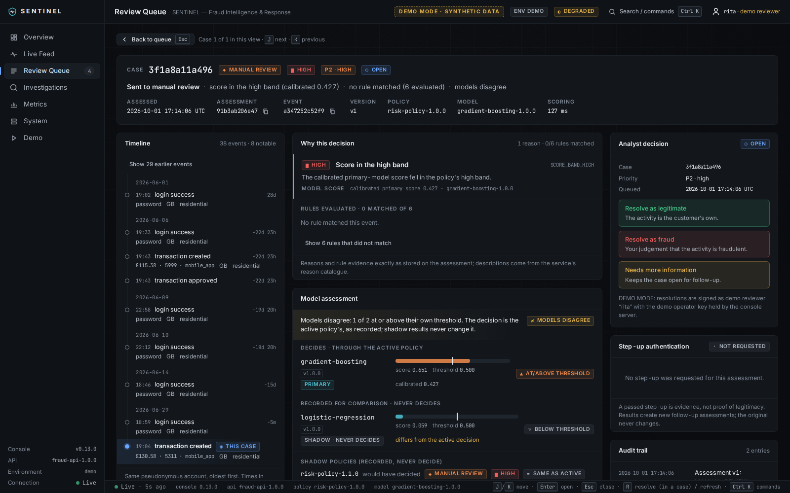
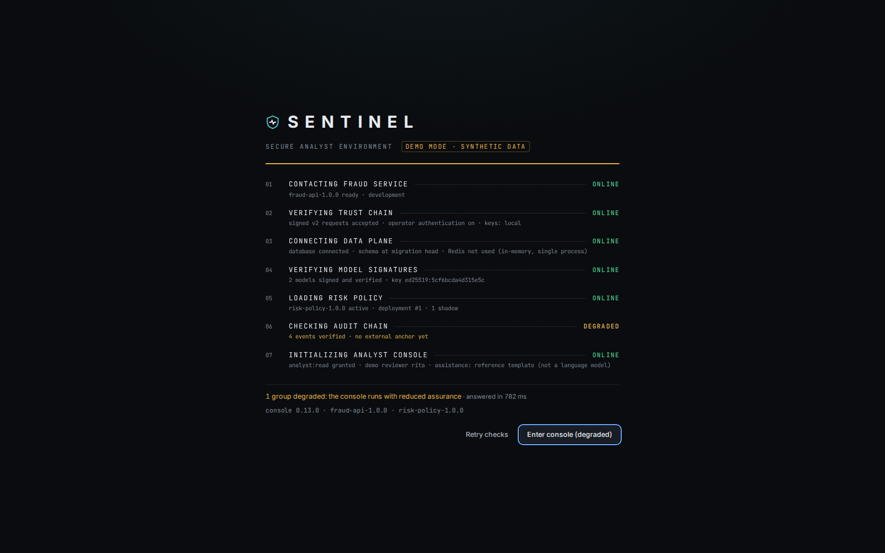
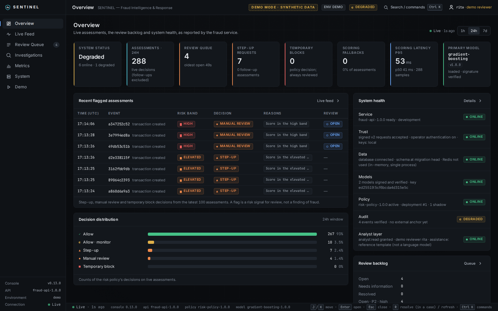
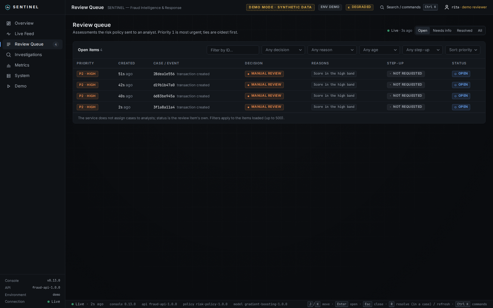
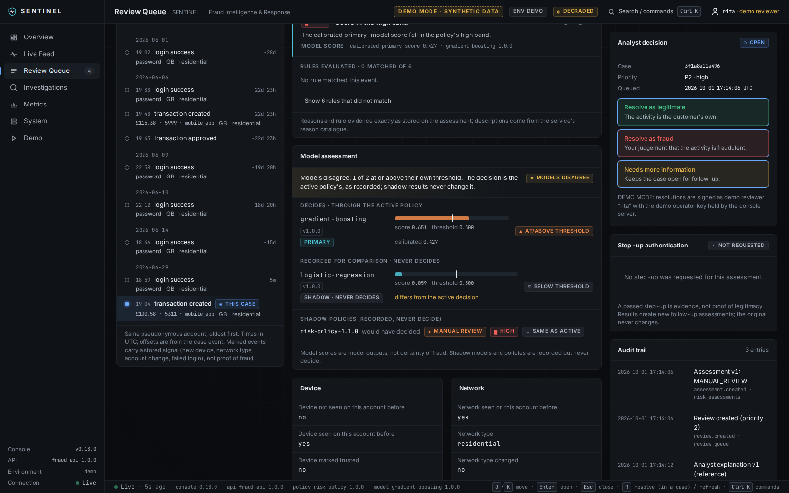
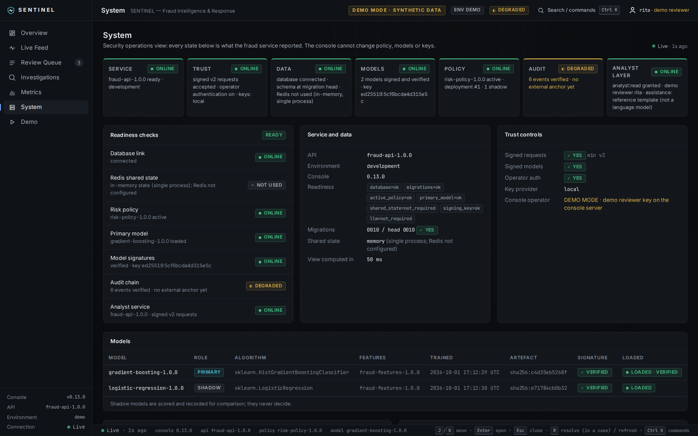

# SENTINEL — Fraud Intelligence & Response

**SENTINEL // Analyst Console** is the analyst interface for the `fraud-ai` service (Stages
13 and 14). To run the whole product on your machine, use the repository's one-command
setup and start ([LOCAL_SETUP.md](../LOCAL_SETUP.md)); this README is for working on the
console itself.
It is a Next.js, React and TypeScript application. It is a **client** of the existing
`/v1` API and duplicates none of the backend's logic: no scoring, risk policy, model
inference, review logic or authentication happens in the console.



| | |
|---|---|
| Start-up checks |  |
| Overview |  |
| Review queue |  |
| Model comparison and investigation |  |
| System health |  |

All screenshots show the **synthetic demo world** only. They are captured by the end-to-end
test (`npm run screenshots`).

## What it does

| Page | What it shows | Source |
|---|---|---|
| Start-up | seven lines (fraud service, trust chain, data plane, model signatures, risk policy, audit chain, analyst console), each CHECKING until its real check answers, then ONLINE / DEGRADED / OFFLINE (or NOT USED); leaves by itself only when everything is online | `/v1/ready`, `/v1/analyst/system`, `/api/session` |
| Overview | assessments, review queue, step-up, temporary blocks, fallbacks, latency, primary model, decision distribution, recent flagged assessments, model disagreement, backlog, system health | `/v1/analyst/summary`, `/feed`, `/system` |
| Live Feed | every assessment, newest first; polled every 5 s; can be paused | `/v1/analyst/feed` |
| Review Queue | filters (decision, reason, age, step-up, safe ID) and sorts (priority, newest, oldest); opens the case workspace | `/v1/analyst/reviews` |
| Case workspace | a one-line case summary; timeline with day separators, offsets from the case event and marked signals (left); reasons with title, severity, description and evidence, primary vs shadow models, indicators, and the investigation in three parts (observed evidence, interpretation, limitations) (centre); analyst decision, step-up and audit trail (right) | `/v1/analyst/cases/{id}` |
| Investigations | lookup by case, assessment or event ID; recent cases | `/v1/analyst/search` |
| Metrics | operational metrics and an accessible hourly chart | `/v1/analyst/summary` |
| System | seven groups (Service, Trust, Data, Models, Policy, Audit, Analyst layer) with state and cause; readiness, models and signatures, active policy and bands, trust controls, audit chain and anchor, LLM runtime | `/v1/analyst/system`, `/v1/ready` |
| Demo (DEMO MODE only) | the ten deterministic scenarios, scoring them, and a guarded RESET DEMO | the demo catalogue, `/v1/score` (server-side), `fraud-ai demo reset` |

What it deliberately does **not** do:

* **Invent data.** Business metrics such as "money saved" or "fraud prevented" are not
  measured by the service, so none are shown.
* **Derive scores.** There is no consensus or combined model score. Each model is shown
  against its own threshold, and disagreement is stated, not resolved.
* **Explain beyond the service.** Reason codes are described only by the service's own
  catalogue.
* **Change the platform.** No policy, model or key can be changed from the console.
* **Assign cases.** The service has no case assignment, so the console does not pretend to
  have one.

## Running it

From the repository root, after `setup-local` (see [LOCAL_SETUP.md](../LOCAL_SETUP.md)):

```bash
./scripts/sentinel-start.sh --mode demo     # production build, DEMO MODE  (Windows: .\scripts\sentinel-start.ps1)
./scripts/sentinel-start.sh --mode dev      # next dev with hot reload, Docker PostgreSQL + Redis
cd sentinel-console && npm run demo         # Demo mode attached to this terminal (Ctrl+C stops it)
```

`npm run demo` runs `scripts/demo.mjs`, a thin wrapper over the shared tooling
(`scripts/sentinel.py start --mode demo --foreground`). It accepts the Stage 13 options:
`DEMO_ROOT`, `PYTHON`, `FRAUD_API_PORT`, `CONSOLE_PORT`, `CONSOLE_MODE=start` and
`DEMO_RESET_ON_START=true`. The supervisor:

1. runs the existing, guarded `fraud-ai demo reset` if no demo world exists;
2. starts the service on 127.0.0.1:8080 with the demo world's configuration;
3. starts the console in DEMO MODE on 127.0.0.1:3000, passing the demo API key through
   0600 files that only the console server reads;
4. serves a local control endpoint (random port, random bearer token) that RESET DEMO
   reaches through the console server.

Against any other fraud-ai service:

```bash
export FRAUD_API_BASE_URL=https://fraud-api.internal
export FRAUD_API_CREDENTIAL_FILE=/run/secrets/console-api-key        # scopes below
export FRAUD_API_SIGNING_SECRET_FILE=/run/secrets/console-signing-secret
export SENTINEL_ENVIRONMENT=staging
npm run build && npm start
```

| Variable | Meaning |
|---|---|
| `FRAUD_API_BASE_URL` | the service (default `http://127.0.0.1:8080`) |
| `FRAUD_API_CREDENTIAL` / `_FILE` | the console's API key. It stays in the server process |
| `FRAUD_API_SIGNING_SECRET` / `_FILE` | its v2 request-signing secret. It stays in the server process |
| `FRAUD_API_TIMEOUT_MS` | default timeout for calls to the service (10 000) |
| `SENTINEL_ENVIRONMENT` | the label shown in the UI |
| `SENTINEL_DEMO_MODE` | `true` only for the synthetic demo world |
| `SENTINEL_DEMO_ROOT`, `SENTINEL_DEMO_CONTROL_URL`, `SENTINEL_DEMO_CONTROL_TOKEN` | set by `npm run demo` |
| `SENTINEL_OPERATOR_ID`, `SENTINEL_OPERATOR_KEY_FILE` | **DEMO MODE only**: the demo reviewer key. Ignored, and reported, outside DEMO MODE |
| `SENTINEL_OPERATOR_AUDIENCE` | the operator-assertion audience (default `fraud-ai-admin`) |

### The console's API key

Create the key with the scopes below. Nothing else is needed:

```bash
fraud-ai service-key create --name sentinel-console --expires-in-days 90 --show-signing-secret \
  --scope analyst:read --scope assessment:read --scope review:read --scope review:write \
  --scope policy:read --scope investigation:write
```

`analyst:read` is new in Stage 13. It is read-only and covers `GET /v1/analyst/*`.

### Resolving reviews

* **DEMO MODE:** the console server signs a reviewer assertion with the demo operator
  `rita`'s key. The UI says so wherever this happens.
* **Everywhere else:** the console holds no operator key. Each resolution needs the
  analyst's own single-use assertion. The confirmation dialog shows the exact command:

  ```bash
  fraud-ai operators assert --key YOUR_KEY --id YOUR_ID --action review.resolve \
    --target <review_id> --bind resolution=<resolution>
  ```

The service verifies the assertion, records the verified reviewer (`operator:<id>`) and
refuses to rewrite a resolved outcome. The console shows that outcome as final.

## Keyboard

| Key | Action |
|---|---|
| <kbd>Ctrl</kbd>/<kbd>⌘</kbd> <kbd>K</kbd> | command palette: go to a page, look up an ID, the demo scenarios (they open the Demo page), system status, refresh, compact density, presentation mode |
| <kbd>J</kbd> / <kbd>K</kbd> | next / previous row. Inside a queue case: next / previous case |
| <kbd>Enter</kbd> | open the selected row |
| <kbd>Esc</kbd> | close a dialog, clear the selection, or return to the queue |
| <kbd>R</kbd> | inside a case: open the resolve panel (brings the outcomes into view and focuses the first; **never** chooses or submits). Elsewhere: refresh the data |

No single key performs an irreversible action. Resolutions and RESET DEMO always need a
button and a confirmation that says what will happen. RESET DEMO also needs the typed
phrase. The investigation runs from its button only.

## View preferences

* **Compact density** (palette): tighter rows and spacing for long working sessions.
* **Presentation mode** (palette): slightly larger text, build versions and keyboard hints
  hidden, for a shared screen. System state (the status badge, DEMO MODE, every check) is
  never hidden. "Presentation · exit" in the top bar turns it off.

Both are remembered in this browser only.

## Resilience

* Polls pause in hidden tabs. A failing poll backs off (doubling, capped at 30 s, with
  jitter); when the health check recovers, only the views that failed are re-run once.
* Stale data is labelled stale; nothing old is shown as live.
* Errors name what failed (fraud service, database, Redis, policy, scoring, permission,
  rate limit with the retry time, missing case). An unavailable LLM never blocks case
  review.

## Development

```bash
npm run dev          # next dev (needs FRAUD_API_* in the environment)
npm run lint         # eslint (next core-web-vitals + typescript); fetch() is banned outside src/lib/api
npm run typecheck    # tsc --noEmit (strict, noUncheckedIndexedAccess)
npm test             # vitest: unit, component, API client, server routes, contract
npm run build        # production build
npm run e2e          # Playwright against a freshly reset demo world (build first)
npm run screenshots  # the same, writing docs/screenshots/*.png
```

The tests (`tests/`) cover:

* **Contract:** responses captured from the running demo service must parse with the
  console's schemas.
* **Signing:** the TypeScript v2 signer matches vectors produced by the Python service.
  The demo assertion is accepted by the Python verifier when it is importable.
* **Proxy:** the allow-list, same-origin checks, unconfigured and unreachable backends.
* **Session:** the session never exposes secrets.
* **Demo guards:** every demo control is refused outside DEMO MODE; reset needs the phrase.
* **Honest states:** CHECKING until answered; OFFLINE when unreachable; degraded audit
  anchor; permission denied.
* **Error states:** service unavailable, rate limited, not found, LLM unavailable, timeout,
  schema mismatch.
* **Components:**
  * no consensus score;
  * reason descriptions come only from the service;
  * confirmation is required and a resolution submits once;
  * a resolved case is final;
  * the command palette holds no dangerous commands.
* **Stage 14 (`tests/stage14.test.tsx`):**
  * the seven health groups: CHECKING before any answer, causes from the service, Redis
    and relaxed trust settings as DEGRADED, a signature mismatch as OFFLINE, and an
    unreachable service never shown healthy from an older answer;
  * readable reason titles, severity only as stored ("Not graded" otherwise);
  * primary vs shadow models, no vote; the case summary; timeline offsets;
  * polling backoff (capped, jittered);
  * R opens the resolve panel and sends nothing; the confirmation says what will happen;
  * analyst assistance split into observed evidence, interpretation and limitations.
* **Bundle:** after a build, no credential, signing code, private key, database or Redis
  URL, Vault token or demo/Dev credential file name is in the browser bundle.
* **End to end (`e2e/`):** the analyst flow on a freshly reset demo world against the real
  service, with an axe-core WCAG 2.1 A/AA audit of five screens, the R key, and a clean
  browser console (no errors or warnings) throughout. CI runs it in the `local-scripts`
  job.

See [ARCHITECTURE.md](ARCHITECTURE.md) for how the console is built and
[DESIGN_SYSTEM.md](DESIGN_SYSTEM.md) for the visual language.
